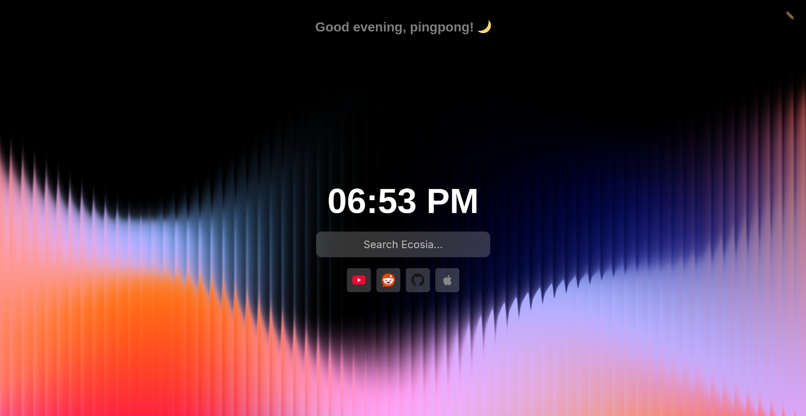

# Simple Startpage

This is a simple startpage I made for personal use in my webbrowser. It's nothing fancy but it doesn't aspire to be.

## Configuration

When you first open the website, there will be a popup asking you for your name. This name will be used in the greeting at the top. If you wish to change the name you can click on the edit button in the top righthand corner, which will reprompt the popup to enter your name.

The shortcuts and search engine are currenty hardcoded. If you wish to change them, you'll need to edit the entries in the index.html and script.js files respectively.

## Credits

The favicon was generated using [favicon.io](https://favicon.io/)